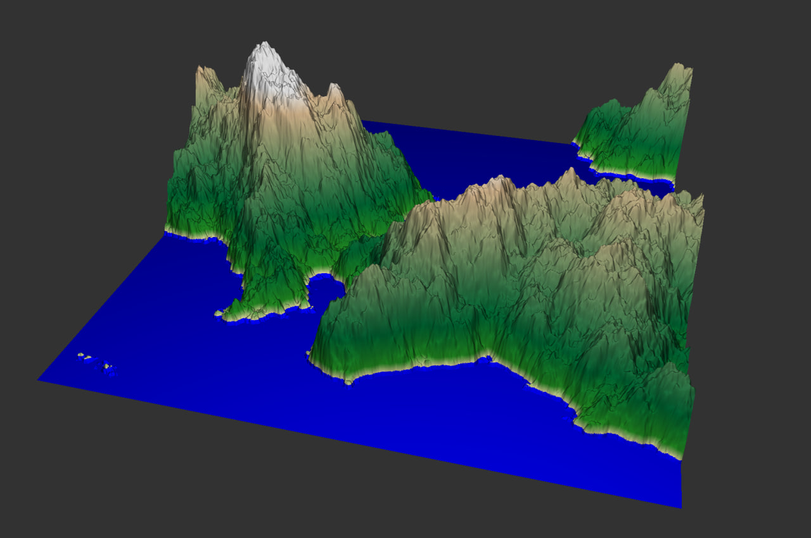

# Landscape visualizer from scratch

## Requirement

1. OpenFrameworks (+ ofGui addon)
2. GLFW

# Implemented algorithm

1. Z-buffer rendering
2. Simplex noise generation
3. Simple lightning and texture generation

# Function

1. Scene zoom & rotation
2. Landscape smoothness & steepness control
3. Mesh step control
4. Textures
5. Amount of water on the surface

# Example

